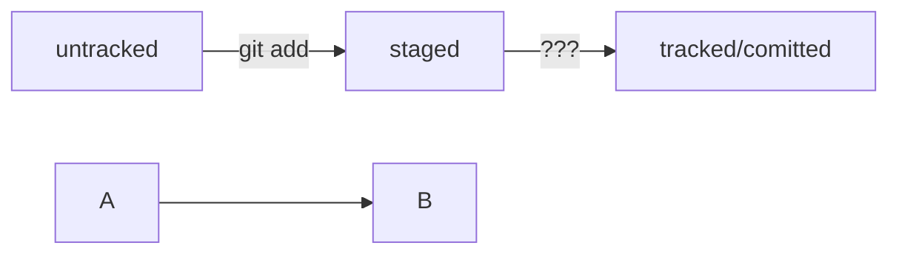

# Шпаргалка с командами для git
### ```pwd``` - показывает расположение
### ```cd ~/nazvaniye-papki``` - переходит в указанную папку
### ```cd ~``` - переходит в домашнюю папку
### ```ls``` - показывает содержимое папки
### ```git init``` - создает репозиторий
### ```rm -rf.git``` - разгитить документ
### ```git status``` - проверяет состояние репозитория
### ```git commit -m "текст коммита"``` - создает коммит
### ```touch text.txt``` - создает файл
### ```mkdir nazvaniye-papki``` - создает папку
### ```cat text.txt``` - распечатывает текст файла
### ```get add --all``` - подготавливает файл к сохранению
### ```git log``` - просматривает историю коммитов в обратном порядке
### ```git push -u origin main``` - синронизирует удаленный репозиторий с локальным
# Стили написания коммитов
## Корпоративный стиль
### Во многих компаниях применяется Jira — система для организации проектов и задач
### У каждой задачи в Jira есть идентификатор из нескольких заглавных латинских букв и номера
### Например, LGS-239 значит, что это 239-я задача в проекте LGS (сокращение от англ. logistics — «логистика»)
### В корпоративном стиле в начале сообщения обычно указывают Jira-ID, а после — текст сообщения.
### Коммит в таком стиле будет выглядеть вот так:
### ```$ git commit -m "LGS-239: Дополнить список пасхалок новыми числами"```
## стиль Conventional Commits
### Стандарт Conventional Commits (англ. «соглашение о коммитах») отличается качественной документацией и подробной проработкой
### Он подходит для репозиториев с исходным кодом программ. А вот использовать его для других типов проектов было бы неудобно.
### Conventional Commits предлагает такой формат коммита: ```<type>: <сообщение>```
### Первая часть ```type``` — это тип изменений. Таких типов достаточно много
### Вот два примера:
### ```feat``` (сокращение от англ. feature) — для новой функциональности
### ```fix``` (от англ. «исправить», «устранить») — для исправленных ошибок
### Например, сообщение может быть таким
### ```git commit -m "feat: добавить подсчёт суммы заказов за неделю"```
## GitHub-стиль
### GitHub можно использовать не только для хранения файлов проекта, 
### но и для ведения списка задач (англ. issue) этого проекта
### Если коммит «закрывает» или «решает» какую-то задачу, то в его сообщении удобно указывать ссылку на неё
### Для этого в любом месте сообщения нужно указать ```#<номер задачи>```.
### Например, вот так
### ```$ git commit -m "Исправить #334, добавить график температуры"```
### В таком случае GitHub свяжет коммит и задачу

HEAD -- это голова.
Коммит -- это всему голова.
Статусы файлов:
<тут пустая строка!>

```mermaid
%% описание схемы
```
<и тут пустая строка!>




